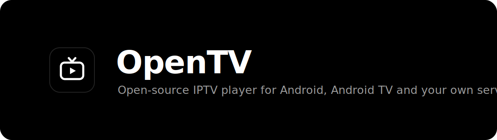

<div align="center">



<br>

[](https://github.com/Buco7854/opentv/actions/workflows/android.yml)
[](LICENSE)


**A fast, private, open-source IPTV player for Android and Android TV.**
M3U, M3U8 and native Xtream, with EPG, catch-up, downloads and a player that
gets out of the way.

</div>

<br>

> [!NOTE]
> This project is vibecoded. It was built end to end with an AI coding
> assistant. Review the code before you rely on it.

> [!IMPORTANT]
> OpenTV is a player only. It does not provide any channels, streams or
> subscriptions, and none are included. You bring your own M3U playlist or
> Xtream login from a provider you already use.

## Download

OpenTV is distributed as an APK that you install yourself. It is not on the Play
Store. There are two channels:

- **Latest release**: the most recent tagged, stable version.
  [Download](https://github.com/Buco7854/opentv/releases/latest/download/app-release.apk)
- **Dev channel**: rebuilt from the latest commit on `main`.
  [Download](https://github.com/Buco7854/opentv/releases/download/dev/app-release.apk)

Both builds are signed with the same key, so updates install in place without
losing your data. Full instructions and documentation are on the
**[OpenTV docs site](https://opentv.grimbert.net/)**.

## Web client

OpenTV also ships as a self-hosted web app with the same experience: the
Android app and the web server share the same core modules (parsing,
classification, Xtream, EPG, catch-up, metadata and the SQLite data layer);
only the UI differs. Playlists are stored server-side in SQLite.

```bash
docker run -d -p 127.0.0.1:8080:8080 -v opentv-data:/data \
  ghcr.io/buco7854/opentv-web:latest
```

> [!WARNING]
> The web server has **no authentication**: anyone who can reach it can use
> your playlists and read your provider credentials. Always run it behind an
> authenticated reverse proxy (or a VPN); never expose it directly to the
> internet. See the [web client guide](https://opentv.grimbert.net/guide/webclient)
> for a Caddy basic-auth example, configuration and limitations.

## Why OpenTV

Most M3U players either hammer your provider until you get blacklisted, guess
content types badly, or bury features behind a clumsy UI. OpenTV is built around
three ideas: be gentle on the provider, classify content intelligently, and look
genuinely good while doing it.

## Features

- **Sources**: native Xtream login (server-side Live, Movies and Series with no
  classification guessing, the full series catalog, and auto-wired EPG and
  catch-up) plus M3U/M3U8 by URL or file. Flat playlists get smart, unit-tested
  VOD detection, and a `get.php` URL is offered an automatic upgrade to Xtream.
- **Browsing**: list or poster-grid views with 4K/FHD/HDR badges, a filter bar,
  global search, favorites keyed by stable identity, and rich movie, series and
  episode pages with cast photos (keyless via TVMaze and iTunes).
- **Watching**: Media3/ExoPlayer (HLS, TS, MP4, MKV) with embedded audio and
  subtitle track selection and styling, skip and scale gestures,
  Picture-in-Picture (including auto-PiP), continuous resume, EPG now/next with a
  full guide, and catch-up/timeshift replay.
- **Downloads**: offline movies and episodes with pause and resume, progress
  notifications and a manager; connection-aware so they never trip your
  provider's limit.
- **Account and ops**: a connection and expiry monitor, an in-app error log with
  credentials redacted, and full Android TV support (leanback, D-pad focus).

Full walkthroughs are on the **[docs site](https://opentv.grimbert.net/)**.

## Gentle on your provider

Getting blacklisted is the number one IPTV annoyance, so OpenTV minimizes
requests by design: conditional GETs (a 304 for an unchanged playlist or EPG),
refresh throttling (playlist at least 6h, EPG at least 12h) with single-flight
collapsing, on-demand-only deep guide fetches, one pooled HTTP client with a
32 MB disk cache, and streaming M3U/XMLTV parsers batched into Room. A full
Xtream refresh is six requests.

## Tech

Kotlin, Jetpack Compose (Material 3), Media3 and ExoPlayer, Room, WorkManager,
DataStore, OkHttp and Coil. Single-module app, MVVM, around 50 unit tests, CI on
every push.

## Building

```bash
./gradlew :app:testDebugUnitTest  # unit tests
./gradlew :app:assembleRelease    # release APK (signed with your key if provided, else debug-signed)
./gradlew :app:assembleDebug      # debug APK
```

Requires JDK 17 or newer and the Android SDK (platform 35). The CI workflow runs
the unit tests and builds a release APK on every push. It refreshes the rolling
dev release on `main`, and publishes a tagged GitHub Release when you push a
`vX.Y.Z` tag.

## Documentation site

The docs site lives in `docs/` and is built with Docusaurus, themed to match
the web client. To work on it:

```bash
cd docs
npm install
npm run docs:dev      # local preview
npm run docs:build    # production build
```

It deploys to GitHub Pages automatically when `docs/` changes on `main`.

## Privacy

OpenTV has no servers, accounts, analytics or ads. Credentials and data stay on
your device. The app only talks to your provider and optional keyless metadata
APIs. Full policy: **[PRIVACY.md](PRIVACY.md)**.

## Contributing

Issues and PRs are welcome. Please keep changes covered by the existing build and
test setup (`./gradlew testDebugUnitTest`) and match the surrounding style.

## License

Released under the GNU GPL v3.0. You may use, study, modify and redistribute it,
provided the source stays open under the same license. See [LICENSE](LICENSE).

Copyright 2026 Buco7854.
