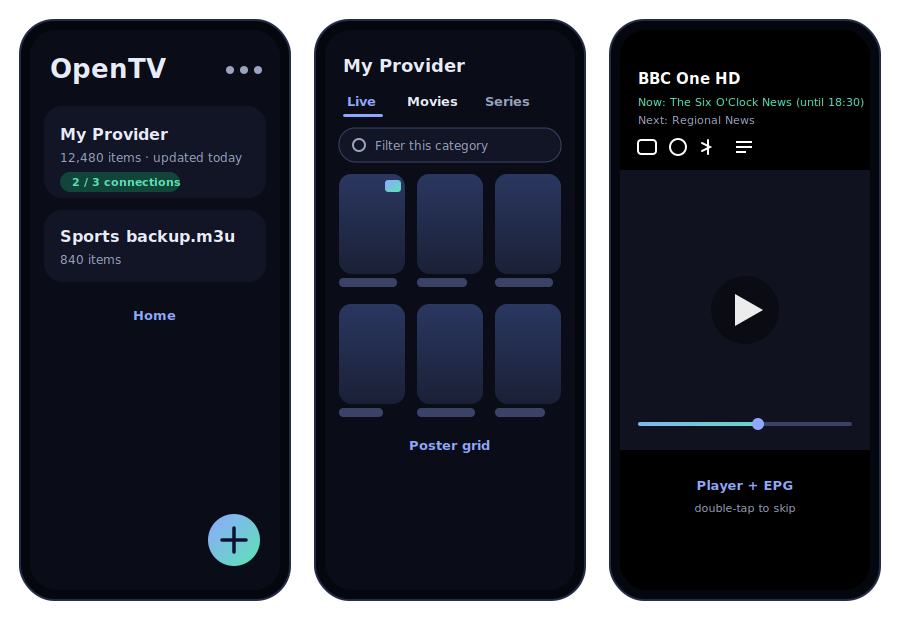

<div align="center">


<br>

[](https://github.com/Buco7854/opentv/actions/workflows/android.yml)
[](LICENSE)


**A fast, private, open-source IPTV player for Android and Android TV.**
M3U, M3U8 and native Xtream, with EPG, catch-up, downloads and a player that
gets out of the way.

</div>

<br>



> The images above are design renderings of the UI. For real device captures,
> see the release listing.

## Download

OpenTV is distributed as an APK that you install yourself. It is not on the Play
Store. There are two channels:

- **Latest release**: the most recent tagged, stable version.
  [Download](https://github.com/Buco7854/opentv/releases/latest/download/app-debug.apk)
- **Dev channel**: rebuilt from the latest commit on `main`.
  [Download](https://github.com/Buco7854/opentv/releases/download/dev/app-debug.apk)

Both builds are signed with the same key, so updates install in place without
losing your data. Full instructions and documentation are on the
**[OpenTV docs site](https://opentv.grimbert.net/)**.

## Why OpenTV

Most M3U players either hammer your provider until you get blacklisted, guess
content types badly, or bury features behind a clumsy UI. OpenTV is built around
three ideas: be gentle on the provider, classify content intelligently, and look
genuinely good while doing it.

## Features

**Sources**

- Native Xtream login (server, username and password): server-side Live, Movies
  and Series categories with no classification guessing, the full series catalog
  (plot, cast, rating, cover), lazily fetched episodes, panel movie details, and
  automatically wired EPG and catch-up. A full refresh is six requests.
- M3U and M3U8 by URL or local file. Paste a `get.php` URL and the app offers to
  upgrade it to the richer Xtream mode automatically.
- Smart VOD detection for flat M3U: layered signals (Xtream URL segments, then
  episode markers, then group keywords, then extension, then year tag) so series
  served as plain streams do not pollute Live, and separator rows are dropped.
  Mis-tagged categories can be re-typed by hand, and this is covered by unit tests.

**Browsing**

- List or poster-grid views (per your preference, persisted), with quality
  badges such as 4K, FHD and HDR on rows and posters.
- A filter bar that narrows the current category or the category list itself.
- Global search across live, movies and series, using the same row components as
  browsing so everything looks and behaves identically.
- Favorites for channels, movies and series, keyed by stable identity so they
  survive refreshes, on their own screen with list and grid views and sections.
- Rich detail pages for movies, series and individual episodes: synopsis, rating,
  genre and runtime, and cast with photos (keyless via TVMaze and iTunes).

**Watching**

- Hardware-accelerated Media3 and ExoPlayer (HLS, TS, MP4, MKV) with optional
  software-decoder fallback.
- Subtitles and tracks: pick embedded subtitle and audio tracks, turn subtitles
  off, change playback speed, and configure subtitle size, style and bold with a
  live preview.
- Gestures: double-tap left or right to skip by your configured step, rotate,
  change video scaling (Fit, Zoom, Stretch), immersive fullscreen, and
  lifecycle-aware pause.
- Picture-in-Picture: a player button plus auto-PiP when you press Home, with
  play and pause controls inside the floating window.
- Resume: VOD playback position is saved continuously, so movies and episodes
  pick up where you left off even after the app is killed.
- EPG (XMLTV): now and next with progress on live rows, a full per-channel guide
  (also inside the player), with gzip supported.
- Catch-up and timeshift: replay past programmes on archived channels (Xtream
  timeshift or M3U `catchup-source`), from the guide or mid-playback.

**Downloads**

- Offline movies and episodes with pause and resume (byte-range), progress
  notifications, a manager, and a chosen destination folder (SAF).
- Connection-aware: concurrency defaults to your plan's max connections minus one
  and yields to live playback, so downloads never trip your provider's limit.

**Account and operations**

- Connection monitor: active and maximum connections and plan expiry on a
  dedicated account page.
- In-app error log with full stack traces (and previous-session crashes),
  credentials redacted.
- Android TV: leanback launcher entry, banner, and D-pad focus throughout.

## Gentle on your provider

Getting blacklisted is the number one IPTV annoyance. OpenTV minimizes requests
by design:

- Conditional GETs (`If-None-Match` and `If-Modified-Since`), so an unchanged
  playlist or EPG costs a bodiless 304.
- Refresh throttling (playlist at least 6 hours, EPG at least 12 hours unless
  forced) and single-flight collapsing.
- Account status cached for about 60 seconds, and the deep per-channel guide
  fetched only on demand and cached.
- One pooled HTTP client with a 32 MB disk cache, and logos fetched once via Coil.
- Streaming M3U and XMLTV parsers (batched into Room), so playlists with tens of
  thousands of entries do not blow up memory.

## Tech

Kotlin, Jetpack Compose (Material 3), Media3 and ExoPlayer, Room, WorkManager,
DataStore, OkHttp and Coil. Single-module app, MVVM, around 50 unit tests, CI on
every push.

## Building

```bash
./gradlew :app:assembleDebug      # debug APK
./gradlew :app:testDebugUnitTest  # unit tests
./gradlew :app:assembleRelease    # minified release (debug-signed unless a keystore is provided)
```

Requires JDK 17 or newer and the Android SDK (platform 35). The CI workflow
uploads a debug APK artifact on every push, refreshes the rolling dev release on
`main`, and attaches an APK to a GitHub Release when you tag `vX.Y.Z`.

## Documentation site

The docs site lives in `docs/` and is built with VitePress. To work on it:

```bash
cd docs
npm install
npm run docs:dev      # local preview
npm run docs:build    # production build
```

It deploys to GitHub Pages automatically when `docs/` changes on `main`.

## Privacy

OpenTV has no servers, accounts, analytics or ads. Credentials and data stay on
your device. The app only talks to your provider and optional keyless metadata
APIs. Full policy: **[PRIVACY.md](PRIVACY.md)**.

## Contributing

Issues and PRs are welcome. Please keep changes covered by the existing build and
test setup (`./gradlew testDebugUnitTest`) and match the surrounding style.

## License

Released under the GNU GPL v3.0. You may use, study, modify, redistribute, and
even sell it, provided the source stays open under the same license. See
[LICENSE](LICENSE).

Copyright 2026 Buco7854.
