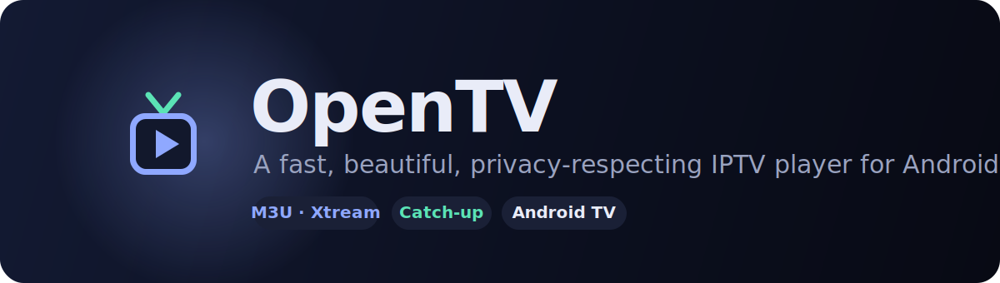

<div align="center">



<br>

[](https://github.com/Buco7854/opentv/actions/workflows/android.yml)
[](LICENSE)


**A fast, beautiful, privacy-respecting IPTV player for Android & Android TV.**
M3U, M3U8 and native Xtream — with EPG, catch-up, downloads and a player that
gets out of the way.

</div>

<br>


> _The images above are design renderings of the UI. For real device captures,
> see the release listing._

---

## Why OpenTV

Most M3U players either hammer your provider until you get blacklisted, guess
content types badly, or bury features behind a clumsy UI. OpenTV is built around
three ideas: **be gentle on the provider**, **classify content intelligently**,
and **look genuinely good** while doing it.

## Features

**Sources**
- **Native Xtream login** (server + username + password): server-side
  Live / Movies / Series categories with *no* classification guessing, the full
  series catalog (plot, cast, rating, cover), lazily-fetched episodes, panel
  movie details, auto-wired EPG and catch-up. A full refresh is **6 requests**.
- **M3U / M3U8** by URL or local file. Paste a `get.php` URL and the app offers
  to upgrade it to the richer Xtream mode automatically.
- **Smart VOD detection** for flat M3U: layered signals (Xtream URL segments →
  `SxxExx`/episode markers → group keywords → extension → year tag) so series
  served as `.ts` don't pollute Live, and `#### SEPARATOR ####` rows are dropped.
  Mis-tagged categories can be re-typed by hand; covered by unit tests.

**Browsing**
- **List or poster-grid** views (per your preference, persisted), with quality
  **badges** (4K/FHD/HDR…) on rows and posters.
- **Filter bar** that narrows the current category or the category list itself.
- **Global search** across live, movies and series, using the same row
  components as browsing so everything looks and behaves identically.
- **Favourites** for channels, movies and series — keyed by stable identity so
  they survive refreshes — on their own screen with list/grid + sections.
- **Rich detail pages** for movies, series and individual episodes: synopsis,
  rating, genre/runtime, and **cast with photos** (keyless via TVMaze/iTunes).

**Watching**
- **Hardware-accelerated** Media3/ExoPlayer (HLS, TS, MP4, MKV) with optional
  software-decoder fallback.
- **Subtitles & tracks**: pick embedded subtitle/audio tracks, "off", playback
  speed; configurable subtitle size/style/bold with live preview.
- **Gestures**: double-tap left/right to skip by your configured step; rotate,
  video-scaling (Fit/Zoom/Stretch), immersive fullscreen, lifecycle-aware pause.
- **EPG (XMLTV)**: now/next with progress on live rows, a full per-channel guide
  (also inside the player), gzip supported.
- **Catch-up / timeshift**: replay past programmes on archived channels (Xtream
  timeshift or M3U `catchup-source`), from the guide or mid-playback.

**Downloads**
- Offline movies & episodes with **pause / resume** (byte-range), progress
  notifications, a manager, and a **chosen destination folder** (SAF).
- **Connection-aware**: concurrency defaults to your plan's `max_connections − 1`
  and yields to live playback, so downloads never trip your provider's limit.

**Account & ops**
- **Connection monitor**: active / max connections and plan expiry on a
  dedicated account page.
- **In-app error log** with full stack traces (and previous-session crashes),
  credentials redacted.
- **Android TV**: leanback launcher entry, banner, D-pad focus throughout.

## Gentle on your provider

Getting blacklisted is the #1 IPTV annoyance. OpenTV minimises requests by design:

- Conditional GETs (`If-None-Match` / `If-Modified-Since`) → unchanged playlist/EPG cost a bodiless 304.
- Refresh throttling (playlist ≥ 6 h, EPG ≥ 12 h unless forced) and single-flight collapsing.
- Account status cached ~60 s; the deep per-channel guide is fetched only on demand and cached.
- One pooled HTTP client with a 32 MB disk cache; logos fetched once via Coil.
- Streaming M3U/XMLTV parsers (batched into Room) — 50k-entry playlists don't blow up memory.

## Tech

Kotlin · Jetpack Compose (Material 3) · Media3/ExoPlayer · Room · WorkManager ·
DataStore · OkHttp · Coil. Single-module app, MVVM, ~50 unit tests, CI on every push.

## Building

```bash
./gradlew :app:assembleDebug      # debug APK
./gradlew :app:testDebugUnitTest  # unit tests
./gradlew :app:assembleRelease    # minified release (debug-signed unless a keystore is provided)
```

Requires JDK 17+ and the Android SDK (platform 35). The CI workflow uploads a
debug APK artifact on every push, and attaches an APK to a GitHub Release when
you tag `vX.Y.Z`.

## Privacy

OpenTV has **no servers, accounts, analytics or ads**. Credentials and data stay
on your device; the app only talks to your provider and optional keyless metadata
APIs. Full policy: **[PRIVACY.md](PRIVACY.md)**.

## Contributing

Issues and PRs welcome. Please keep changes covered by the existing build/test
setup (`./gradlew testDebugUnitTest`) and match the surrounding style.

## License

Released under the **GNU GPL v3.0** — you may use, study, modify, redistribute,
and even sell it, provided the source stays open under the same license. See
[LICENSE](LICENSE).

Copyright © 2026 Buco7854.
